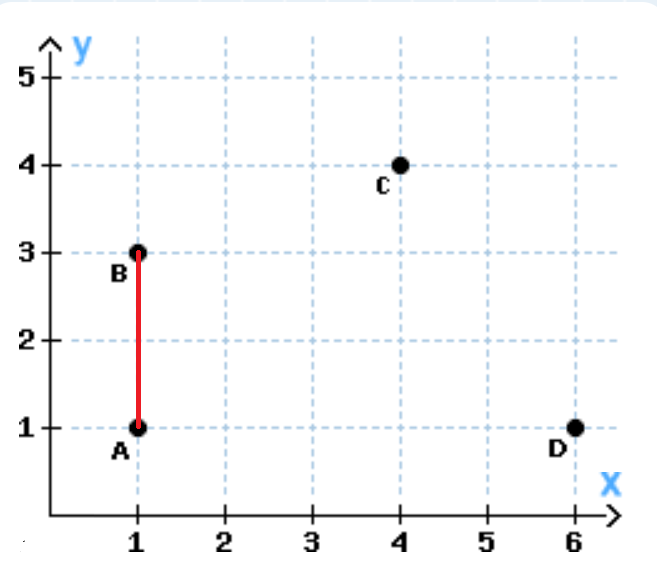

# NodeJs-CalculateDistanceOfPoints
The Javascript NodeJs Program calculates the minimum and maximum distance of points.

Sample Coordinates: A(1, 1), B(1, 3), C(4, 4), D(6, 1) 

Minimum distance of all points = 2.0

## Prepare

**npm install**

## Test

**npm test**

## Run
### CMD Version

**npm run start**

or 

**node src/nodeJsCalcPointsApp.js**

Output:

>Start App...
>
>Minimum distance of all points = 2.0
>
>Maximum distance of all points = 5.385164807134504

or run with params

**npm run start "(4,3) (5,2) (1,1) (1,2)"**

or

**node src/nodeJsCalcPointsApp.js "(4,3) (5,2) (1,1) (1,2)"**

Calling the app with this params should result in:
 
Output:

>Start App...
>
>Minimum distance of all points = 1.0
>
>Maximum distance of all points = 4.123105625617661

Hint: Only use single digit numbers as point coordinates like (4,3)!

### Web Version

**node src/nodeJsCalcPointsWeb.js**

http://localhost:8080/

## Travis

Each commit to GitHub will result in a automated online travis CI/CD build.

https://travis-ci.com/github/Hefezopf/NodeJs-CalculateDistanceOfPoints
